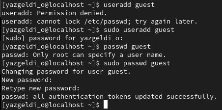
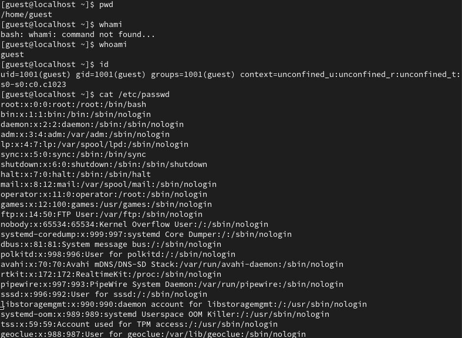
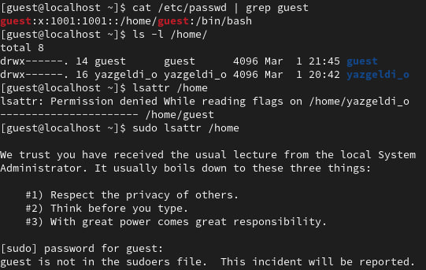
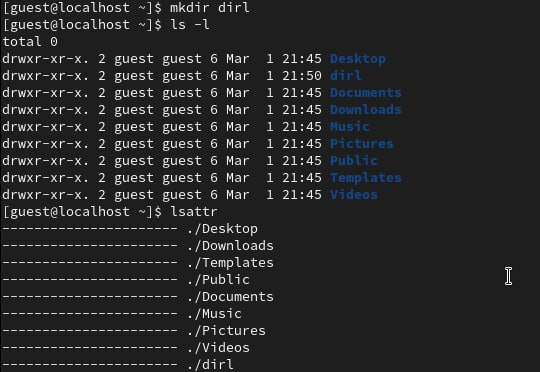
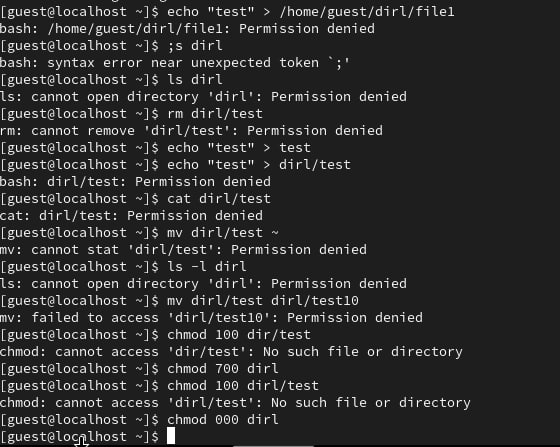
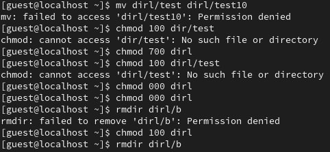

---
## Front matter
lang: ru-RU
title: Основы информационной безопасности
subtitle: Лабораторная работа № 2
author:
  - Оразгелдиев Язгелди
institute:
  - Российский университет дружбы народов, Москва, Россия

## i18n babel
babel-lang: russian
babel-otherlangs: english

## Formatting pdf
toc: false
toc-title: Содержание
slide_level: 2
aspectratio: 169
section-titles: true
theme: metropolis
header-includes:
 - \metroset{progressbar=frametitle,sectionpage=progressbar,numbering=fraction}
 - '\makeatletter'
 - '\beamer@ignorenonframefalse'
 - '\makeatother'
---

# Информация

## Докладчик

:::::::::::::: {.columns align=center}
::: {.column width="70%"}

  * Оразгелдиев Язгелди
  * студент 2-го курса
  * Российский университет дружбы народов
  * [orazgeldiyev.yazgeldi@gmail.com](mailto:orazgeldiyev.yazgeldi@gmail.com)
  * <https://YazgeldiOrazgeldiyev.github.io/ru/>

## Актуальность

- Работа в консоли Линукс очень важна для дальнейшей практики

## Цели и задачи

- Получение практических навыков работы в консоли с атрибутами файлов, закрепление теоретических основ дискреционного разграничения доступа в современных системах с открытым кодом на базе ОС Linux

## Материалы и методы

- Операционная система Linux
- RedHat

## Содержание исследования

1. Создали гостевую дополнительную учетную запись и входим в виртуальную машину от его имени. 

{#fig:001 width=70%}

## Содержание исследования

2. Мы в новой учетной записи прописали некоторые команды для того, чтобы вывести информацию о пользователе guest

{#fig:002 width=70%}

## Содержание исследования

3. Определили uid, gid пользователя и сравниваем с предыдущими пунктами 

{#fig:003 width=70%}

## Содержание исследования

4. Создали поддиректорию dirl

{#fig:004 width=70%}

## Содержание исследования

5. Тестировали на поддиректории различные команды и изменяем права доступа. Проверяли работу команд

{#fig:005 width=70%}

## Содержание исследования

6. Заполняли таблицу, выполняя действия от имени владельца директорий

{#fig:006 width=70%}

## Результаты

- Получение практических навыков работы в консоли с атрибутами файлов, закрепление теоретических основ дискреционного разграничения доступа в современных системах с открытым кодом на базе ОС Linux

## Итоговый слайд

- Лучше сделать сегодня хоть что-то, чем завтра ничего!

